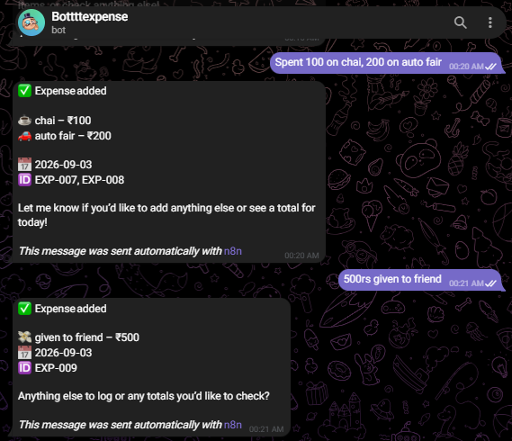
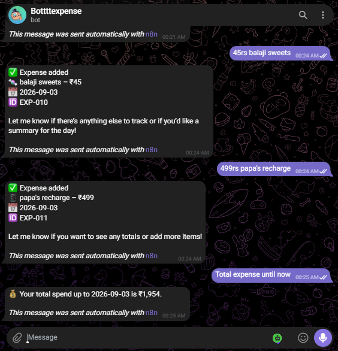
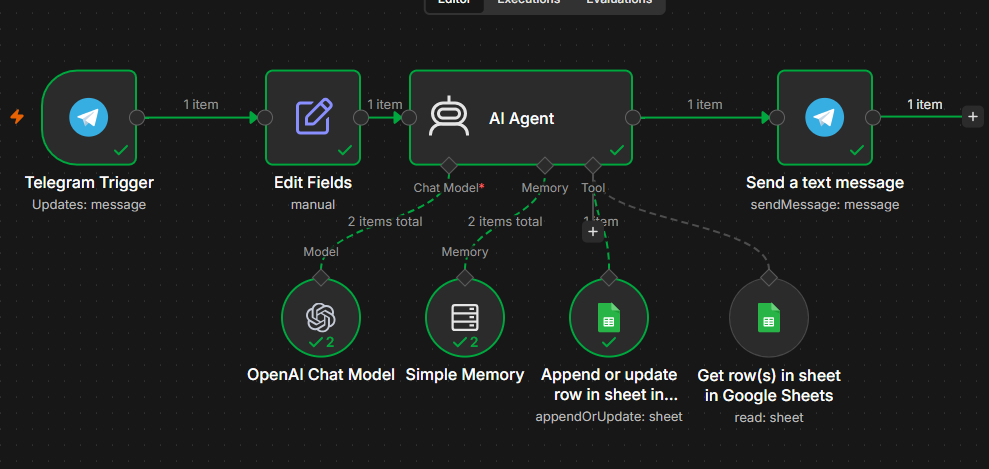
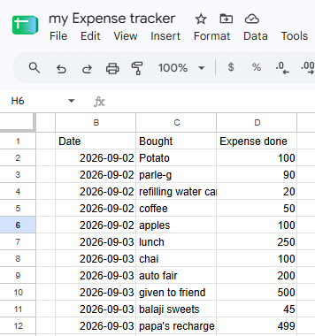

# 💰 Telegram AI Expense Tracker

An AI-powered personal expense tracker built using **n8n, Telegram, Google Sheets, and an LLM**.

The system allows users to record expenses naturally through Telegram and ask questions about their spending using natural language.

---

## 📸 Project Demo

### Telegram Bot




### n8n Workflow



### Google Sheets



---

## 🚀 Features

- Add expenses through Telegram
- Automatically generate unique Expense IDs
- Automatically record the date of the expense
- Store expense data in Google Sheets
- Support multiple expenses in a single message
- Retrieve previously recorded expenses
- Calculate total expenditure for a specific day
- Calculate expenditure for a specific date
- Calculate monthly expenditure
- Ask natural-language questions about expenses
- Maintain conversation context using n8n Memory

---

## 🏗️ Workflow Architecture

```text
Telegram
   │
   ▼
Telegram Trigger
   │
   ▼
Edit Fields
   │
   ├── Extract Telegram Message
   └── Convert Timestamp to IST Date
   │
   ▼
AI Agent
   │
   ├──────────────► OpenAI Chat Model
   │
   ├──────────────► Simple Memory
   │
   ├──────────────► Google Sheets
   │                  └── Add / Update Expense
   │
   └──────────────► Google Sheets
                      └── Read Expenses
   │
   ▼
Telegram Response

# 💰 Telegram AI Expense Tracker

An AI-powered personal expense tracker built using **n8n, Telegram, Google Sheets, and an LLM**.

The system allows users to record expenses naturally through Telegram and ask questions about their spending using natural language.

---

## 🛠️ Technologies Used

- **n8n** — Workflow automation
- **Telegram** — User interface
- **LLM / OpenAI** — Natural language understanding
- **Google Sheets** — Expense data storage
- **n8n Simple Memory** — Conversation context

---

## 📊 Google Sheets Structure

| Expense ID | Date       | Bought | Expense Done |
|------------|------------|--------|--------------|
| EXP-001    | 2026-09-01 | Coffee | 100          |
| EXP-002    | 2026-09-01 | Lunch  | 250          |
| EXP-003    | 2026-09-02 | Petrol | 800          |

Each expense is stored as a separate row.

---

## 💬 Example Usage

### Add an Expense

**User:**

> I spent ₹250 on lunch today.

**Bot:**

> ✅ Expense added  
> 🍽️ Lunch — ₹250  
> 📅 2026-09-02  
> 🆔 EXP-004

---

### Add Multiple Expenses

**User:**

> Today I spent ₹100 on tea, ₹300 on lunch and ₹200 on auto.

The AI records each expense as a separate row in Google Sheets.

---

### Check Today's Expenditure

**User:**

> How much did I spend today?

**Bot:**

> 💰 You spent ₹600 today.

---

### Check a Specific Date

**User:**

> How much did I spend on September 1?

**Bot:**

> 💰 You spent ₹1,150 on September 1, 2026.

---

### Check Monthly Expenditure

**User:**

> How much have I spent this month?

**Bot:**

> 💰 Your total expenditure this month is ₹4,850.

---

## 🔄 How It Works

1. The user sends an expense or question through Telegram.
2. The Telegram Trigger receives the message.
3. n8n extracts the message and Telegram timestamp.
4. The timestamp is converted to Indian Standard Time.
5. The AI Agent interprets the user's request.
6. New expenses are stored in Google Sheets.
7. Existing expenses can be retrieved from Google Sheets.
8. Relevant records are filtered based on date or other criteria.
9. Expense amounts are aggregated to calculate totals.
10. The result is returned to the user through Telegram.

---

## 📅 Date Handling

Telegram provides the message timestamp in Unix timestamp format.

The workflow converts this timestamp to Indian Standard Time using:

```javascript
{{ DateTime.fromSeconds($json.message.date).setZone('Asia/Kolkata').toFormat('yyyy-MM-dd') }}
```

Expenses are therefore stored using:

```text
YYYY-MM-DD
```

---

## 🧠 AI Agent Capabilities

The AI Agent can understand natural-language requests such as:

```text
I spent 250 on lunch today.

How much did I spend today?

How much did I spend yesterday?

How much did I spend on September 1?

How much have I spent this month?

Show me my expenses.

How much did I spend on food?
```

The AI uses the expense records stored in Google Sheets to answer these questions.

---

## ⚙️ Setup

### 1. Import the n8n workflow

Import the workflow JSON into your n8n instance.

### 2. Configure Telegram

Connect your Telegram Bot credentials.

### 3. Configure Google Sheets

Create a Google Sheet with the following columns:

```text
Expense ID
Date
Bought
Expense Done
```

Connect your Google Sheets credentials.

### 4. Configure the LLM

Connect your preferred LLM credentials to the AI Agent.

### 5. Configure Google Sheets Tools

The AI Agent uses Google Sheets tools to add and retrieve expense records.

### 6. Activate the Workflow

Activate the workflow and start interacting with the expense tracker through Telegram.

---

## 🔐 Security

Do not commit API keys, bot tokens, passwords, OAuth secrets, or other sensitive credentials to this repository.

The workflow file provided in this repository should contain sanitized configuration only.

---

## 🔮 Future Improvements

- Expense categories
- Weekly expense summaries
- Monthly reports
- Budget limits
- Budget alerts
- Category-wise spending analysis
- Expense charts and dashboards
- Voice-based expense entry
- Recurring expense tracking
- Automated weekly/monthly reports
- Expense data visualization

---

## 👨‍💻 Project

Built as a practical project to explore:

**AI Agents + Workflow Automation + Natural Language Processing + Data Storage + Data Analysis**
